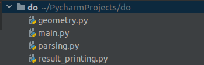
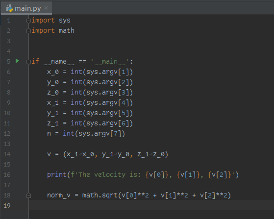
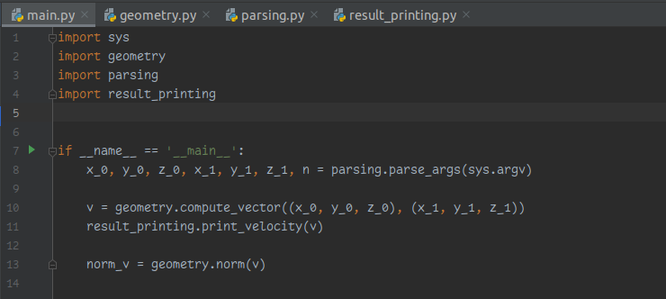
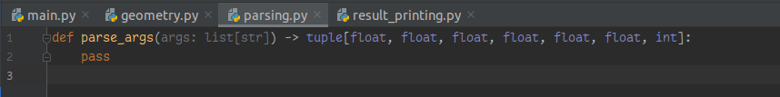
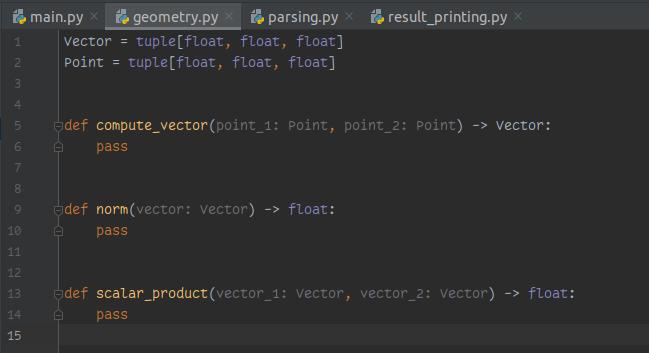
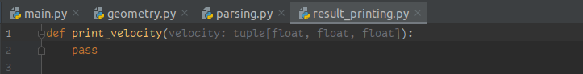
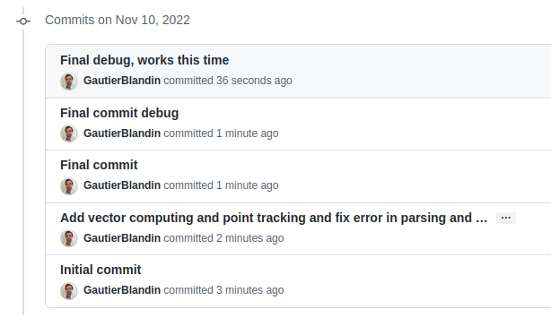

# Do and don't in math projects
## Project architecture
### Don't
Keep everything in one file

### Do
Separate different logical steps into different modules

## Functionalities

### Don't

Mash functionalities together in one big main script

### Do
Separate functionalities into functions, and group similar functionalities in logical modules

## Git

### Don't
- Commit unrelated functionalities together
- Commit without explaining what the commit does
- Commit multiple functionalities together

### Do
- Commit atomic changes
- Explain concisely what the commit does
- Use imperative style

