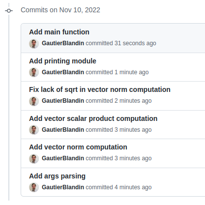

# Do and don't in math projects
## Warning
#### Code that does not try to follow the guidelines about project architecture and functionalities will not be reviewed beyond "You should follow the guidelines"
## Project architecture
### Don't
Keep everything in one file

### Do
Separate different logical steps into different modules

## Functionalities

### Don't

Mash functionalities together in one big main script

### Do
Separate functionalities into functions, and group similar functionalities in logical modules

## Git

### Don't
- Commit unrelated functionalities together
- Commit without explaining what the commit does
- Commit multiple functionalities together

### Do
- Commit atomic changes
- Explain concisely what the commit does
- Use imperative style

## Testing

### Don't
- Not test important functions
- Test from a script

### Do
- Test from a test file
- Test important functions
- Use a testing framework
- Have an appropriate architecture

Some IDEs let you directly run tests from the file, and you can also run them from the command line with pytest

